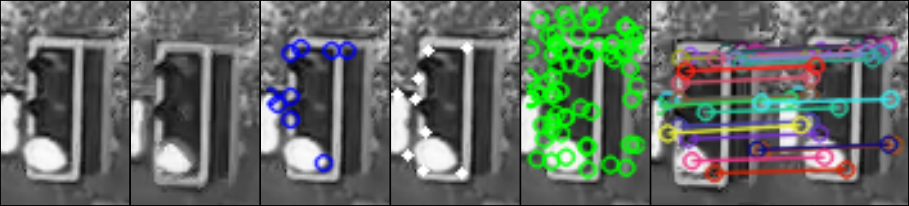

## Some experiment over traffic-light (Python 2.7 + OpenCV)

Some folders are separate projects

File and folder structure:

1. [detector.py](./detector.py) + [src](./src) -- base detector red, green and yellow detector

Extract some mp4 and run `detector proceed <name>` or `detector init <name>`

2. [cameras](./cameras) -- list of compressed camera with traffic lights
3. [docs](./docs) -- some literature
4. [motion-detector](./motion-detector) -- detect traffic light moving based on Lucas Kanade optical flow

Copy extracted tf2.mp4 to motion-detector and run `main.py`

5. [tracks](./tracks) -- visualise traffic light moving tracks based on SIFT

Copy extracted tf2.mp4 to tracks and run `SIFT_track.py`

6. [stabilize](./stabilize) -- Stabilise traffic light moving based on Lucas Kanade optical flow and Affine transform

Copy extracted tf2.mp4 to stabilize and run `lk_stabilize.py`

7. [result](./result) -- result videos

You can see short experiments results on the video